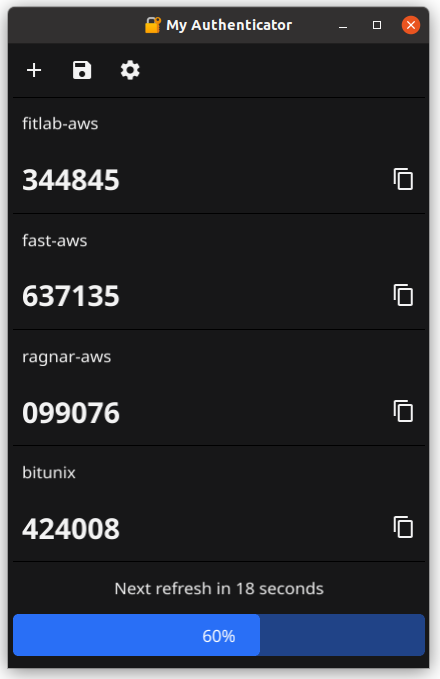

# 🔐 My Authenticator

A secure, desktop Time-based One-Time Password (TOTP) authenticator application built with Go and Fyne GUI framework. Similar to Google Authenticator but designed for desktop use with encrypted local storage.


## 📱 Application Preview



*Clean, modern interface showing TOTP codes with auto-refresh progress bar and one-click copy functionality*

## ✨ Features

- **🔒 Secure Storage**: All TOTP secrets are encrypted using AES-GCM with PBKDF2 key derivation
- **⏱️ Auto-Refresh**: TOTP codes automatically update every 30 seconds with visual progress indicator
- **📱 Modern GUI**: Clean, intuitive interface built with Fyne framework
- **📋 Easy Copy**: One-click copy TOTP codes to clipboard with non-intrusive notifications
- **�️ Easy Management**: Add and remove entries with simple dropdown selection
- **�📤 QR Code Export**: Generate QR codes for importing entries into other authenticator apps
- **🎨 Icon-Based Interface**: Modern icon-only buttons for a clean look
- **🔔 Smart Notifications**: Temporary notifications in top-right corner that auto-disappear
- **📦 Debian Package**: Easy installation with .deb package generation

## 🚀 Quick Start

### Prerequisites

- Go 1.25.1 or later
- GTK3 development libraries (for GUI)
- Linux environment (tested on Ubuntu/Debian)

Install system dependencies:
```bash
sudo apt-get update
sudo apt-get install build-essential libgtk-3-dev
```

### Building from Source

1. **Clone the repository:**
   ```bash
   git clone https://github.com/vsjadeja/my-authenticator.git
   cd my-authenticator
   ```

2. **Install dependencies:**
   ```bash
   make deps
   ```

3. **Build the application:**
   ```bash
   make build
   ```

4. **Run the application:**
   ```bash
   ./build/my-authenticator
   ```

### Installation via Debian Package

1. **Build the .deb package:**
   ```bash
   make deb
   ```

2. **Install the package:**
   ```bash
   sudo dpkg -i build/my-authenticator.deb
   ```

3. **Launch from applications menu or run:**
   ```bash
   my-authenticator
   ```

## 🛠️ Development

### Available Make Targets

| Command | Description |
|---------|-------------|
| `make build` | Build the application binary |
| `make deps` | Download and install Go dependencies + Fyne CLI |
| `make clean` | Remove build artifacts |
| `make deb` | Create a Debian (.deb) package |

### Project Structure

```
├── main.go              # Main application code
├── Makefile            # Build automation
├── go.mod              # Go module definition
├── go.sum              # Dependency checksums
├── icon.png            # Application icon
├── build.sh            # Legacy build script
└── README.md           # This file
```

## 🔧 Usage

### Adding TOTP Entries

1. Click the **➕ Add** button
2. Enter the service name (e.g., "GitHub", "Google")
3. Enter the secret key provided by the service
4. Click **Add** to save

### Managing Codes

- **Copy Code**: Click the copy icon next to any TOTP code
- **Auto-Refresh**: Codes automatically update every 30 seconds
- **Progress Bar**: Visual indicator shows time remaining until next refresh

### Removing Entries

1. Click the **🗑️ Remove** button in the top toolbar
2. Select the entry you want to remove from the dropdown
3. Click **Remove** to confirm (⚠️ This action cannot be undone!)
4. Entry is permanently deleted and UI updates automatically

### Exporting Entries

1. Click the **💾 Export** button
2. Select the entry you want to export
3. View the QR code to scan with another authenticator app

## 🔐 Security Features

- **AES-GCM Encryption**: All secrets encrypted with 256-bit AES-GCM
- **PBKDF2 Key Derivation**: 4096 iterations with SHA-256
- **Local Storage**: Data stored locally in encrypted `securedata.bin` file
- **No Network Access**: Application works completely offline

## 🏗️ Technical Details

### Dependencies

- **[Fyne v2.6.3](https://fyne.io/)**: Cross-platform GUI framework
- **[OTP Library](https://github.com/pquerna/otp)**: TOTP code generation
- **[QR Code](https://github.com/skip2/go-qrcode)**: QR code generation
- **[Go Crypto](https://golang.org/x/crypto)**: Cryptographic functions

### Architecture

- **Custom AutoProgressBar**: Self-updating progress widget with animation
- **Encrypted Storage**: JSON data encrypted with AES-GCM
- **Thread-Safe UI**: Uses Fyne's animation system for safe UI updates
- **Modular Design**: Separate functions for UI, crypto, and TOTP operations

## 🐛 Troubleshooting

### Build Issues

**GTK3 not found:**
```bash
sudo apt-get install libgtk-3-dev pkg-config
```

**CGO linking errors:**
```bash
export CGO_LDFLAGS="-L/usr/lib/x86_64-linux-gnu"
export CGO_CPPFLAGS="-I/usr/include"
```

### Runtime Issues

**Application won't start:**
- Ensure all GTK3 libraries are installed
- Check that the binary has execute permissions

**Encrypted data corruption:**
- Backup `securedata.bin` before updates
- Application will create new empty file if data is corrupted

## 📝 License

This project is licensed under the MIT License - see the [LICENSE](LICENSE) file for details.

## 🤝 Contributing

1. Fork the repository
2. Create a feature branch (`git checkout -b feature/awesome-feature`)
3. Commit your changes (`git commit -am 'Add awesome feature'`)
4. Push to the branch (`git push origin feature/awesome-feature`)
5. Open a Pull Request

## 📞 Support

- **Issues**: [GitHub Issues](https://github.com/vsjadeja/my-authenticator/issues)
- **Documentation**: This README and code comments
- **Security**: For security issues, please email privately

## 🙏 Acknowledgments

- [Fyne](https://fyne.io/) - Excellent Go GUI framework
- [OTP Library](https://github.com/pquerna/otp) - Robust TOTP implementation
- [Go Team](https://golang.org/) - Amazing programming language

---

**⚠️ Security Note**: This application stores encrypted TOTP secrets locally. Always backup your `securedata.bin` file and keep your device secure.